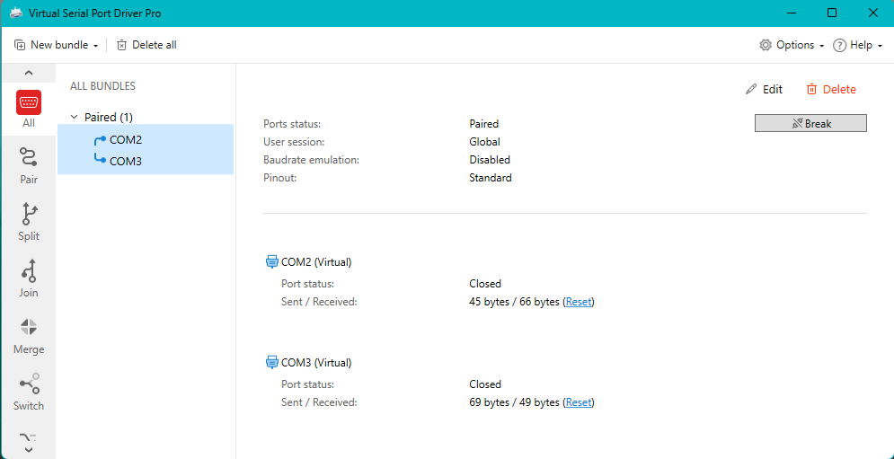

# 2nd version
Изменения:
* cmake -> qmake
* второе окно в новом потоке для имитации работы железа

## Демонстрация
### Создание виртуальных портов

### Работа программы

https://previews.dropbox.com/p/thumb/ACbz8Dy9kSm42K98ReHJnLwk1Vr7GqkTHuklUTbkrBUkaIjbyiFWbgnqpTbZd2-ZuLY2DyGyhIavfDVtj6fZwFAuHOfgMvE61G_2BExbj0Foa-zh8C9IpBGHHXBEpl39niE9u4e8ab4hR9b-rKA3PA03gTfOLN6IVxOLXIu9uiKBu36JJn49yAtzU7TNRkxvmW1493jo3xt6F4zr27TlaFJIxem_Yy2x6_S1moO_Pb8G8ictD_J-rxcfDNvcRVjCiY7iTOl0W7PWfpYeoVb7bHLH7HXMVTnExnAF1w5hZa5J5euwKNr3I9d8tuoBpp3uE3c/p.gif

